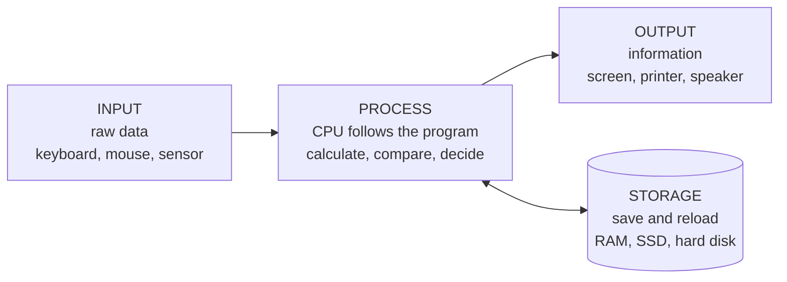
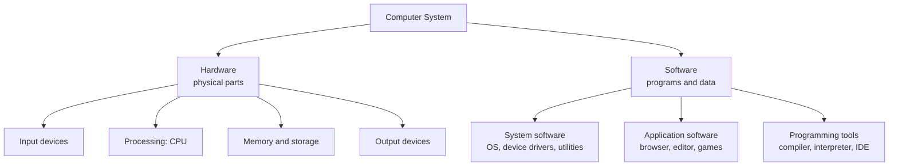
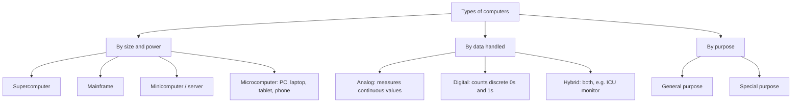

import RunInLab from '@site/src/components/RunInLab';
import AskBox from '@site/src/components/AskBox';

# Computer Basics

<p className="nx-lede">
Start here even if you have never opened a computer's settings page. This topic
answers four questions in order: what a computer is, how it works inside, what
it is good and bad at, and which kinds exist. Every later topic in this section
builds on these four answers.
</p>

## Overview

A **computer** is an electronic machine that takes in raw facts (**input**),
works on them by following a stored list of instructions (**processing**),
gives back a useful result (**output**), and can keep both the facts and the
results for later (**storage**).

The one line worth memorising:

<div className="nx-def">
  <span className="nx-def__tag">Definition</span>
  A computer is an electronic device that accepts data as input, processes it
  according to a stored set of instructions (a program), produces information as
  output, and stores data and results for future use.
</div>

Three words in that sentence do a lot of work, so pin them down now:

| Term | Meaning | Example |
| --- | --- | --- |
| **Data** | Raw, unorganised facts. On their own they mean little. | `78, 91, 65, 84` |
| **Processing** | Any operation performed on data — sorting, adding, comparing, formatting. | Adding the four marks, dividing by 4 |
| **Information** | Processed data that now carries meaning and can support a decision. | "Average = 79.5, grade B" |

:::tip Exam tip
"Data is input, information is output" is the shortest correct answer for a
one-mark question. A computer does not create information out of nothing — it
only reorganises the data you give it.
:::

### The IPO cycle

Everything a computer does, from a calculator app to a weather forecast, fits
this one loop. Storage sits beside the loop because data can be saved at any
stage and pulled back in later.



<p className="nx-note">
Read the loop with a real task: you type <code>78 91 65 84</code> (input), the
CPU adds and divides (process), the screen shows <code>79.5</code> (output), and
the file you save keeps it for tomorrow (storage).
</p>

## Key Concepts

### The block diagram of a computer

This is the single most asked diagram in computer fundamentals. Draw it once,
correctly, and label the two kinds of line — **solid lines carry data, dashed
lines carry control signals.**

<figure className="nx-fig">
  <svg className="nx-svg" viewBox="0 0 880 470" role="img" aria-label="Block diagram of a computer showing input unit, CPU containing control unit, arithmetic and logic unit and memory unit, and output unit">
    <defs>
      <marker id="nxArrow" markerWidth="10" markerHeight="10" refX="9" refY="3.2" orient="auto">
        <path d="M0,0 L9,3.2 L0,6.4 z" className="nx-head" />
      </marker>
      <marker id="nxArrowC" markerWidth="10" markerHeight="10" refX="9" refY="3.2" orient="auto">
        <path d="M0,0 L9,3.2 L0,6.4 z" className="nx-head nx-head--ctrl" />
      </marker>
    </defs>

    {/* CPU container */}
    <rect x="224" y="40" width="420" height="380" rx="18" className="nx-cpu" />
    <text x="240" y="66" className="nx-eyebrow">CENTRAL PROCESSING UNIT (CPU)</text>

    {/* boxes */}
    <rect x="14" y="200" width="176" height="72" rx="12" className="nx-box" />
    <text x="102" y="230" textAnchor="middle" className="nx-t">Input Unit</text>
    <text x="102" y="252" textAnchor="middle" className="nx-s">keyboard, mouse, scanner</text>

    <rect x="254" y="92" width="170" height="68" rx="12" className="nx-box" />
    <text x="339" y="120" textAnchor="middle" className="nx-t">Control Unit</text>
    <text x="339" y="142" textAnchor="middle" className="nx-s">directs and times</text>

    <rect x="444" y="92" width="170" height="68" rx="12" className="nx-box" />
    <text x="529" y="120" textAnchor="middle" className="nx-t">ALU</text>
    <text x="529" y="142" textAnchor="middle" className="nx-s">calculates, compares</text>

    <rect x="284" y="300" width="300" height="76" rx="12" className="nx-box nx-box--mem" />
    <text x="434" y="330" textAnchor="middle" className="nx-t">Memory Unit</text>
    <text x="434" y="352" textAnchor="middle" className="nx-s">holds data, instructions and results</text>

    <rect x="690" y="200" width="176" height="72" rx="12" className="nx-box" />
    <text x="778" y="230" textAnchor="middle" className="nx-t">Output Unit</text>
    <text x="778" y="252" textAnchor="middle" className="nx-s">monitor, printer, speaker</text>

    {/* data flow */}
    <polyline points="190,236 214,236 214,338 284,338" className="nx-flow" markerEnd="url(#nxArrow)" />
    <polyline points="584,338 640,338 640,236 690,236" className="nx-flow" markerEnd="url(#nxArrow)" />
    <line x1="505" y1="300" x2="505" y2="166" className="nx-flow" markerEnd="url(#nxArrow)" />
    <line x1="553" y1="160" x2="553" y2="294" className="nx-flow" markerEnd="url(#nxArrow)" />

    {/* control flow */}
    <polyline points="254,140 204,140 204,180 102,180 102,194" className="nx-ctrl" markerEnd="url(#nxArrowC)" />
    <line x1="424" y1="126" x2="438" y2="126" className="nx-ctrl" markerEnd="url(#nxArrowC)" />
    <line x1="339" y1="160" x2="339" y2="294" className="nx-ctrl" markerEnd="url(#nxArrowC)" />
    <polyline points="390,92 390,74 778,74 778,194" className="nx-ctrl" markerEnd="url(#nxArrowC)" />

    {/* legend */}
    <line x1="24" y1="440" x2="74" y2="440" className="nx-flow" />
    <text x="84" y="445" className="nx-s">data flow</text>
    <line x1="184" y1="440" x2="234" y2="440" className="nx-ctrl" />
    <text x="244" y="445" className="nx-s">control signals</text>
  </svg>
  <figcaption>
    Fig 1 — Block diagram of a computer. The CPU is not one part: it is the
    control unit and the ALU working together, with the memory unit feeding both.
  </figcaption>
</figure>

What each block is responsible for:

| Unit | Job in one line | Remember it as |
| --- | --- | --- |
| **Input unit** | Accepts data from the user and converts it into binary the machine understands. | The ears |
| **Control unit (CU)** | Fetches instructions, decodes them, and tells every other unit when to act. It does not do the maths itself. | The manager |
| **ALU** | Performs arithmetic (`+ − × ÷`) and logic (greater than, equal to, AND, OR, NOT). | The worker |
| **Memory unit** | Holds the program, the input data and the intermediate results while work is going on. | The desk |
| **Output unit** | Converts binary results back into a form humans can read or hear. | The mouth |
| **Storage** | Keeps data after the power goes off. | The cupboard |

:::note CU + ALU + registers = CPU
The CPU is called the **brain of the computer** because it is the only part that
both decides and calculates. Memory is often drawn inside the CPU box in
textbooks, but physically the main memory (RAM) sits on the motherboard beside
the processor.
:::

### Characteristics of a computer

Six properties are asked again and again. The trick is that each one has a
matching limitation, which is why the next section exists.

| Characteristic | What it means |
| --- | --- |
| **Speed** | Executes millions to billions of instructions per second. Timings are measured in milliseconds down to nanoseconds and picoseconds. |
| **Accuracy** | Results are correct to a very high degree — errors come from wrong input or a wrong program, not from the machine. |
| **Diligence** | No tiredness, no boredom, no drop in quality between the first task and the millionth. |
| **Versatility** | The same hardware runs a spreadsheet, a game and a heart-rate monitor, depending only on the program loaded. |
| **Storage capacity** | Holds huge volumes of data and recalls any item almost instantly. |
| **Automation** | Once a program starts, it runs to the end without a human at each step. |

Units of speed, worth memorising as a ladder:

| Unit | Value | Used for |
| --- | --- | --- |
| Millisecond (ms) | one-thousandth of a second | Disk access, network ping |
| Microsecond (µs) | one-millionth of a second | Older machine cycles |
| Nanosecond (ns) | one-billionth of a second | RAM access, modern CPU cycles |
| Picosecond (ps) | one-trillionth of a second | Signal timing inside a chip |

:::caution GIGO
**Garbage In, Garbage Out.** A computer never checks whether your data makes
sense. Feed it a wrong marks list and it will calculate a wrong average
perfectly, at nanosecond speed.
:::

### What a computer cannot do

<div className="nx-grid">
  <div className="nx-card nx-card--pro">
    <h4>Advantages</h4>
    <ul>
      <li>Very high speed on repetitive work</li>
      <li>Consistent, reliable results</li>
      <li>Stores and retrieves enormous amounts of data</li>
      <li>Reduces paperwork and manual cost over time</li>
      <li>Multitasking — many jobs appear to run at once</li>
      <li>Connects people and services worldwide</li>
    </ul>
  </div>
  <div className="nx-card nx-card--con">
    <h4>Limitations</h4>
    <ul>
      <li>No intelligence of its own — it only follows instructions</li>
      <li>No common sense, feelings or judgement</li>
      <li>Cannot correct a wrong input (GIGO)</li>
      <li>Depends on electricity and on regular maintenance</li>
      <li>Vulnerable to viruses, data theft and hardware failure</li>
      <li>Overuse causes health strain and job displacement concerns</li>
    </ul>
  </div>
</div>

### Hardware and software

A computer system is always both. Hardware is what you can touch; software is
the set of instructions that tells the hardware what to do. Neither is useful
alone.



| | Hardware | Software |
| --- | --- | --- |
| **Nature** | Physical, tangible | Logical, intangible |
| **Made by** | Manufacturing | Programming |
| **Wears out?** | Yes, with age and use | No, but becomes outdated or buggy |
| **If damaged** | Replaced or repaired | Reinstalled or patched |
| **Example** | CPU, RAM, monitor, keyboard | Windows, Linux, Chrome, Python |

:::tip One-liner
Hardware is the body, software is the mind, and **firmware** (like the BIOS) is
the small program permanently stored on a chip that wakes the body up.
:::

### How data is measured

The computer stores everything — text, images, sound, video — as **bits**: 0 or 1.

| Unit | Equal to | Rough feel |
| --- | --- | --- |
| Bit (b) | A single 0 or 1 | On or off |
| Nibble | 4 bits | One hex digit |
| Byte (B) | 8 bits | One character, such as `A` |
| Kilobyte (KB) | 1024 bytes | A page of plain text |
| Megabyte (MB) | 1024 KB | A photo or a song |
| Gigabyte (GB) | 1024 MB | A film |
| Terabyte (TB) | 1024 GB | A large hard disk |

:::note Why 1024 and not 1000?
Because the machine counts in base 2, and 2<sup>10</sup> = 1024. Disk makers
advertise using 1000, which is why a "1 TB" drive shows up as about 931 GB.
:::

### Types of computers

Three different classifications get asked. Keep them separate in your head — the
question always tells you which basis it wants.



By size and capacity, from largest down:

| Type | Scale | Typical use |
| --- | --- | --- |
| **Supercomputer** | Fastest class, massive parallel processing | Weather forecasting, nuclear simulation, genome research. India's PARAM series belongs here. |
| **Mainframe** | Very large, thousands of simultaneous users | Bank transactions, railway reservation, census data |
| **Minicomputer / server** | Mid-range, serves a department | Small business systems, lab control, web servers |
| **Microcomputer** | Single-user, one microprocessor | Desktop, laptop, tablet, smartphone, embedded devices |

By the data they handle:

| Type | Works with | Example |
| --- | --- | --- |
| **Analog** | Continuously varying physical quantities | Speedometer, analog thermometer |
| **Digital** | Discrete binary digits | Every PC and phone you use |
| **Hybrid** | Both, converting one to the other | Patient monitor in an ICU, petrol pump |

### Where computers are used

| Field | What the computer does |
| --- | --- |
| **Education** | Online classes, digital libraries, simulations, exam results |
| **Banking** | ATMs, UPI and net banking, fraud detection, core banking servers |
| **Healthcare** | Patient records, MRI and CT imaging, robotic surgery, drug research |
| **Government** | Aadhaar and PAN databases, e-governance portals, census |
| **Business** | Billing, inventory, payroll, e-commerce, data analytics |
| **Science** | Space missions, weather models, simulations |
| **Entertainment** | Streaming, gaming, animation, music production |

## Example

The point of this program is not the Python — it is that you can see all four
stages of the IPO cycle in nine lines. Read the comments in order.

```python
# 1. INPUT — raw data comes in from the user
marks = [78, 91, 65, 84]

# 2. PROCESS — the CPU works on the data
total = sum(marks)
average = total / len(marks)
grade = "A" if average >= 80 else "B" if average >= 60 else "C"

# 3. OUTPUT — data has become information
print("Total:", total)
print("Average:", average)
print("Grade:", grade)

# 4. STORAGE — the result is kept for later
with open("result.txt", "w") as f:
    f.write(f"Average {average}, Grade {grade}")
```

Expected output:

```text
Total: 318
Average: 79.5
Grade: B
```

Notice what happened: `78, 91, 65, 84` was **data** — four numbers with no
meaning. `Average 79.5, Grade B` is **information** — it answers a question and
supports a decision.

## Run your code

<RunInLab topic="Computer Basics" lang="python" code={`marks = [78, 91, 65, 84]
total = sum(marks)
average = total / len(marks)
grade = "A" if average >= 80 else "B" if average >= 60 else "C"

print("Total:", total)
print("Average:", average)
print("Grade:", grade)`} />

## Practice Questions

Answer each one in your head first, then open it.

<details>
<summary>1. Define a computer in one sentence.</summary>

An electronic device that accepts data as input, processes it according to a
stored set of instructions, produces information as output, and stores data and
results for future use.

</details>

<details>
<summary>2. Which unit of the computer is called its brain, and why?</summary>

The **CPU**, because it contains the control unit that directs every other part
and the ALU that performs all calculations and comparisons. No other unit both
decides and computes.

</details>

<details>
<summary>3. State the difference between data and information with an example.</summary>

Data is raw, unorganised facts — for example `78, 91, 65, 84`. Information is
processed data that carries meaning — for example "average 79.5, grade B".
Processing is what converts one into the other.

</details>

<details>
<summary>4. The ALU performs which two categories of operation?</summary>

**Arithmetic** operations (addition, subtraction, multiplication, division) and
**logical** operations (comparisons such as greater than or equal to, and the
logic operations AND, OR, NOT).

</details>

<details>
<summary>5. Expand GIGO and explain what it implies.</summary>

**Garbage In, Garbage Out.** A computer has no judgement of its own, so it
processes wrong input just as faithfully as correct input. The accuracy of the
output can never be better than the accuracy of the input and the program.

</details>

<details>
<summary>6. How many bits make one byte, and how many bytes make one kilobyte?</summary>

8 bits make 1 byte. 1024 bytes make 1 kilobyte, because the machine counts in
base 2 and 2<sup>10</sup> equals 1024.

</details>

<details>
<summary>7. Name the three types of computers classified by the data they handle.</summary>

**Analog** (continuous physical quantities), **digital** (discrete binary
digits) and **hybrid** (both, converting between them — as in an ICU patient
monitor).

</details>

<details>
<summary>8. Give two characteristics of a computer and one limitation for each.</summary>

*Speed* — but it wastes that speed producing a wrong answer if the input is
wrong. *Diligence* — but it will repeat the same mistake a million times without
noticing, because it has no common sense or self-correction.

</details>

### Quick revision

- Computer = **input → process → output**, with **storage** alongside.
- **Data** goes in, **information** comes out.
- CPU = **control unit + ALU** (+ registers); the CU directs, the ALU computes.
- Six characteristics: **speed, accuracy, diligence, versatility, storage, automation.**
- Main limitation: **no intelligence of its own** — GIGO.
- 8 bits = 1 byte; 1024 bytes = 1 KB.
- By size: **supercomputer > mainframe > mini > micro.**
- By data: **analog, digital, hybrid.**

<AskBox topic="Computer Basics" section="Computer Fundamentals" />
