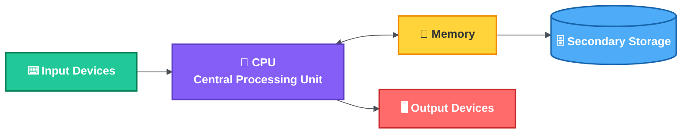
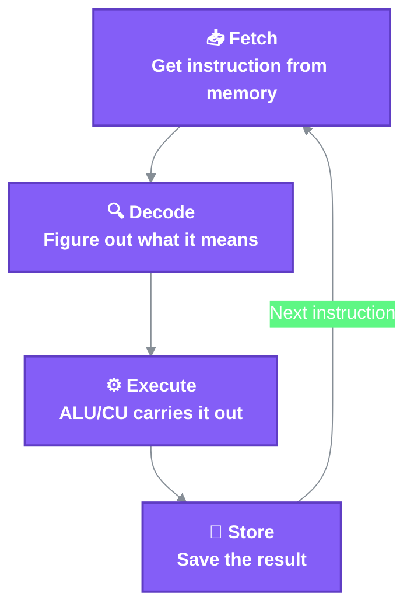
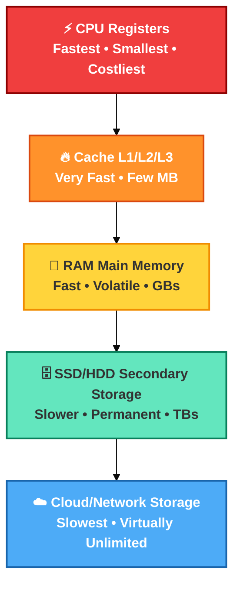
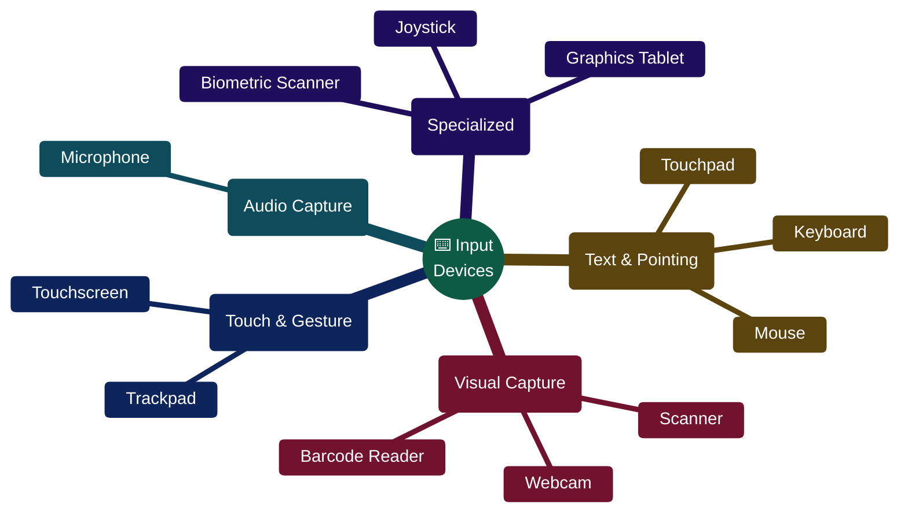
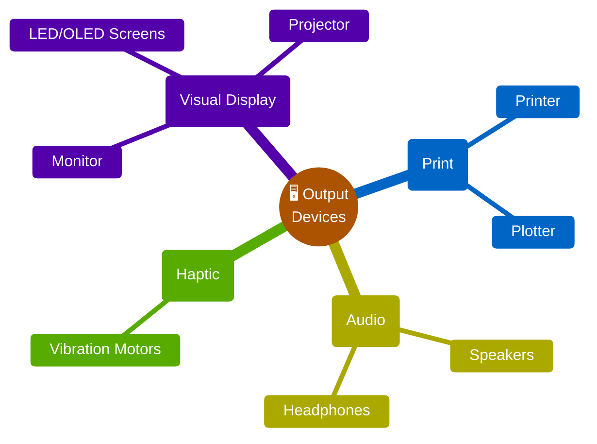
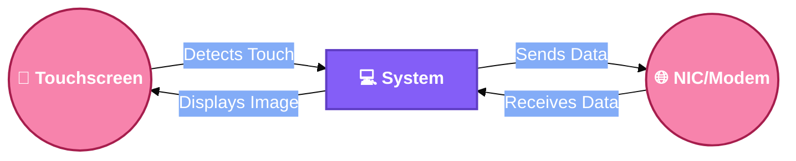
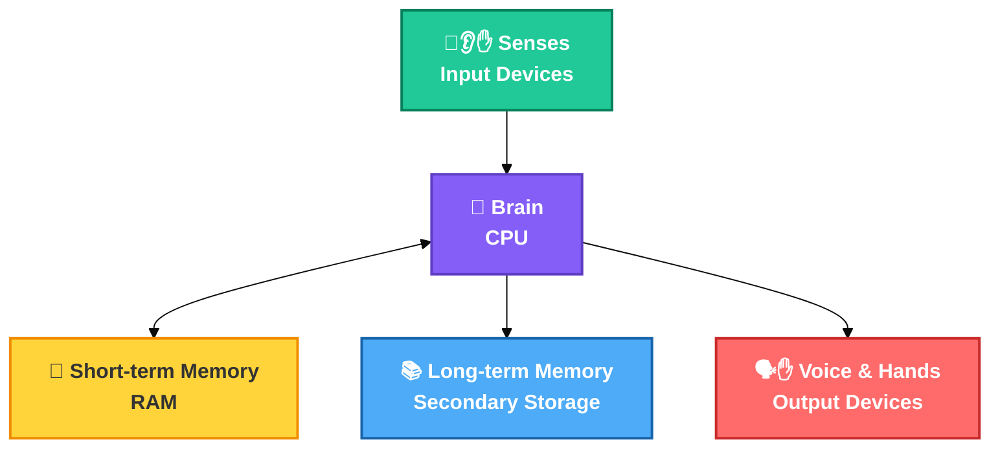

# 🧩 Unit 1 — 1.2 Computer Hardware, Memory, CPU & Input/Output Devices

**Course:** Problem Solving Using Programming (PC-IT-PSP101)
**Institute:** IIIT Allahabad | **Semester:** Fall 2026
**Instructor:** Dr. Mohammed Javed

> Topics covered: The CPU • Memory Hierarchy • Input Devices • Output Devices • Devices that are both Input & Output

---

## 🧩 Overview

Every computer, regardless of size or purpose, is built around the same basic idea: **input → processing → storage → output**. This section breaks down the physical building blocks that make this possible.

---

## 🧠 1. The CPU (Central Processing Unit) — The "Brain"

  

<i>A real CPU chip — this small piece of silicon does all the "thinking."</i>

The CPU is the component that actually executes instructions — it fetches a command, decodes what it means, carries it out, and repeats millions to billions of times per second. It has three core parts:

| Part | Full Name | Job |
|---|---|---|
| **ALU** | Arithmetic Logic Unit | Performs all math (add, subtract, multiply) and logic operations (AND, OR, comparisons) |
| **CU** | Control Unit | Directs traffic — tells other parts of the computer what to do and when, based on the current instruction |
| **Registers** | — | Tiny, ultra-fast storage slots inside the CPU that hold data currently being worked on |

> 💡 **Example:** When you run `2 + 3` in a program, the CPU *fetches* that instruction, *decodes* it as "addition," the **ALU** *executes* the addition, and the **CU** *stores* the result (5) back into memory or a register — all within a fraction of a nanosecond.

**Key CPU specifications you'll commonly see:**
- **Clock speed (GHz)** — how many cycles the CPU completes per second. A 3.5 GHz CPU completes 3.5 billion cycles every second.
- **Cores** — a CPU can have multiple independent processing units (dual-core, quad-core, octa-core) that can work on different tasks simultaneously.
- **Cache (L1/L2/L3)** — small, extremely fast memory built directly into the CPU to avoid constantly waiting on slower main memory.

| CPU Type | Cores (typical) | Common Use |
|---|---|---|
| Entry-level laptop CPU | 2–4 | Browsing, documents, light multitasking |
| Mainstream desktop CPU | 6–8 | Gaming, software development, video calls |
| Workstation/Server CPU | 16–64+ | 3D rendering, scientific simulation, hosting many users at once |

---

## 💾 2. Memory — Where Data Lives

  

<i>Two real DDR-SDRAM modules. <b>Top:</b> 512 MB with a metal heat-spreader, chips on both sides. <b>Bottom:</b> 256 MB, chips on one side only. Note the <b>gold contact pins</b> along the bottom edge and the <b>notch</b> — the notch position stops you from inserting the wrong RAM generation into the motherboard slot.</i>

Memory isn't a single thing — it's a **hierarchy**, trading off speed against size and cost. The closer memory is to the CPU, the faster and more expensive (per byte) it is.

| Type | Volatile? (loses data on power off) | Typical Size | Speed | Example |
|---|---|---|---|---|
| **Registers** | Yes | Bytes | Fastest | Holding a loop counter mid-calculation |
| **Cache (L1–L3)** | Yes | KB–MB | Extremely Fast | Storing recently used instructions/data |
| **RAM (Primary Memory)** | Yes | 8–64 GB (typical) | Fast | Running applications, open browser tabs |
| **SSD/HDD (Secondary Storage)** | No | 256 GB–several TB | Moderate | Saving files, installed programs, the OS itself |
| **Cloud Storage** | No | Effectively unlimited | Slowest (network-dependent) | Google Drive, backups, streaming media |

> 💡 **Example:** Closing a document without saving loses your latest edits because they were only in **RAM**. Once you hit "Save," the data moves to **secondary storage (SSD/HDD)**, where it survives even after the computer is turned off.

### 2.1 RAM vs Storage — A Common Confusion

| | RAM | Storage (SSD/HDD) |
|---|---|---|
| Purpose | Temporary workspace for active tasks | Permanent home for files and programs |
| Speed | Very fast | Slower (though SSDs are much faster than old HDDs) |
| Data on power-off | Lost | Retained |
| Analogy | A desk you're actively working on | A filing cabinet where finished work is stored |

---

## ⌨️ 3. Input Devices — Getting Data In

  

<i>A standard computer keyboard — the most common text-input device.</i>

Input devices let a user (or another system) feed data and commands into the computer.

| Category | Examples | What it's used for |
|---|---|---|
| Text & pointing | Keyboard, Mouse, Touchpad, Stylus | Typing commands, navigating interfaces |
| Visual capture | Webcam, Scanner, Barcode Reader | Capturing images, digitizing documents, reading product codes |
| Audio capture | Microphone | Voice commands, recording, video calls |
| Touch & gesture | Touchscreen, Trackpad | Direct interaction on phones, tablets, kiosks |
| Specialized | Joystick, Graphics Tablet, Biometric Scanner (fingerprint/face) | Gaming, digital art, secure authentication |

---

## 🖥️ 4. Output Devices — Getting Data Out

  
  

<i><b>Left:</b> a computer monitor — <i>soft copy</i> output (temporary, on-screen). <b>Right:</b> an HP LaserJet 1020 laser printer — <i>hard copy</i> output (permanent, on paper). This soft-copy vs hard-copy distinction is a very common exam question.</i>

Output devices convert the computer's internal processing results into a form humans (or other machines) can understand or use.

| Category | Examples | What it's used for |
|---|---|---|
| Visual display | Monitor, Projector, LED/OLED screens | Showing text, images, video |
| Print | Printer, Plotter | Producing physical, paper-based output |
| Audio | Speakers, Headphones | Playing sound, music, voice output |
| Haptic | Vibration motors (phones, controllers) | Physical feedback, e.g. a phone buzzing on notification |

### 4.1 Input & Output Working Together

```mermaid
%%{init: {'theme':'base', 'themeVariables': {
  'primaryColor': '#20C997',
  'primaryTextColor': '#ffffff',
  'primaryBorderColor': '#087F5B'
}}}%%
flowchart LR
    subgraph INPUT [ ⌨️ Input Devices ]
        direction TB
        I1[Keyboard]
        I2[Mouse]
        I3[Microphone]
        I4[Scanner]
    end

    subgraph OUTPUT [ 🖥️ Output Devices ]
        direction TB
        O1[Monitor]
        O2[Printer]
        O3[Speakers]
        O4[Projector]
    end

    INPUT --> CPU2[🧠 CPU + Memory]
    CPU2 --> OUTPUT

    classDef inbox fill:#20C997,stroke:#087F5B,stroke-width:2px,color:#ffffff;
    classDef outbox fill:#FF922B,stroke:#D9480F,stroke-width:2px,color:#ffffff;
    classDef cpubox fill:#845EF7,stroke:#5F3DC4,stroke-width:2px,color:#ffffff,font-weight:bold;

    class I1,I2,I3,I4 inbox;
    class O1,O2,O3,O4 outbox;
    class CPU2 cpubox;
```

> 💡 **Real-world example:** When you speak into a **microphone** (input), the CPU processes your speech using a speech-recognition model held temporarily in **RAM**, and the result — recognized text — appears on the **monitor** (output). If you save that text as a file, it then moves into **secondary storage**.

---

## 🔀 5. Devices That Are Both Input & Output

A few devices act as **both** input and output at once:

| Device | Input Role | Output Role |
|---|---|---|
| Touchscreen | Detects taps/swipes | Displays visuals |
| Network Interface Card (NIC) | Receives data from the network | Sends data to the network |
| External Hard Drive/USB Drive | Reads data into the system | Stores data written from the system |
| Modem | Receives incoming internet signals | Sends outgoing signals |

---

## 🧍 6. Putting It All Together — A Simple Analogy

| Computer Part | Human Body Analogy |
|---|---|
| CPU | Brain — makes decisions and does the "thinking" |
| RAM | Short-term memory — holds what you're actively working on |
| Secondary Storage | Long-term memory — things you remember permanently |
| Input Devices | Senses (eyes, ears, touch) — bring information in |
| Output Devices | Voice, hands, expressions — send information out |

---

## 📚 Quick Recap

| Component | One-line Takeaway |
|---|---|
| CPU | The "brain" — fetches, decodes, executes, and stores instructions using the ALU, CU, and registers |
| Memory Hierarchy | Registers → Cache → RAM → Secondary Storage → Cloud, trading speed for size as you go down |
| Input Devices | Bring data/commands into the system — keyboard, mouse, mic, scanner, and more |
| Output Devices | Present processed results to the user — monitor, printer, speakers, projector |
| I/O Devices | Some devices (touchscreen, NIC, modem) do both jobs at once |
